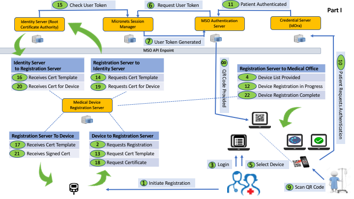

# Identity Service

> 

## About

This is project is designed to create device specific x.509 certificates using a subscriber root certificate.  

## Micronets Flow 
This project serves as the Identity Server below. 

## API
There are three major apis for the Indentify Service. 

1. User/account management - /users 
2. Requesting Cert Templates - /certificate-templates
3. Requesting Certs for the Device - /certificates

## Changelog

__0.1.0__

- Initial release

## License

Copyright (c) 2016

Licensed under the [MIT license](LICENSE).
