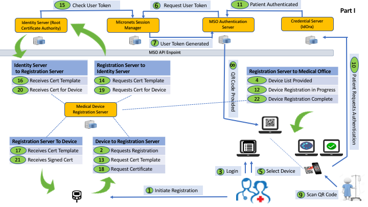

# Identity Service

> 

## About

This is project is designed to create device specific x.509 certificates using a subscriber root certificate.  

## Micronets Device Registration Flow 
This project serves as the Identity Server below. 




## API
There are three major apis for the Indentify Service. 

1. User/account management - /users 
2. Requesting Cert Templates - /csrt
3. Requesting Certs for the Device - /certificates

## Getting Started

#### 1.1 Running the Identity Server manually

1. Make sure you have [NodeJS](https://nodejs.org/) and [npm](https://www.npmjs.com/) installed.
2. Install your dependencies

    ```
    cd path/to/identity-service; npm install
    ```

3. Start your app

    ```
    npm start
    ```


#### 1.2 Running the Identity Server using Docker

The Identity Server distro includes a Dockerfile that can be used to construct Docker images.

To build the Docker images for api and start the container :

   ```
    cd identity-service
    docker-compose up --build
   ```


#### 1.3 Deploying a Docker image to Artifactory

A `Makefile` is provided to generate the Docker image and upload it to the configured artifact repository. 

Both can be accomplished by running:

```make docker-push```

Note that the destination repository and path is configured in the `Makefile` and that Docker will request 
credentials in order to perform the push.

#### 1.4 Retrieving the latest docker image from Artifactory

The commands to retrieve the latest Docker image(s) for the Identity Service are also contained in the included Makefile. 

To pull the latest Docker(s) run:

```make docker-pull```

Note that the source repository and path is configured in the `Makefile`.
No credential should be required to pull the Docker image.


